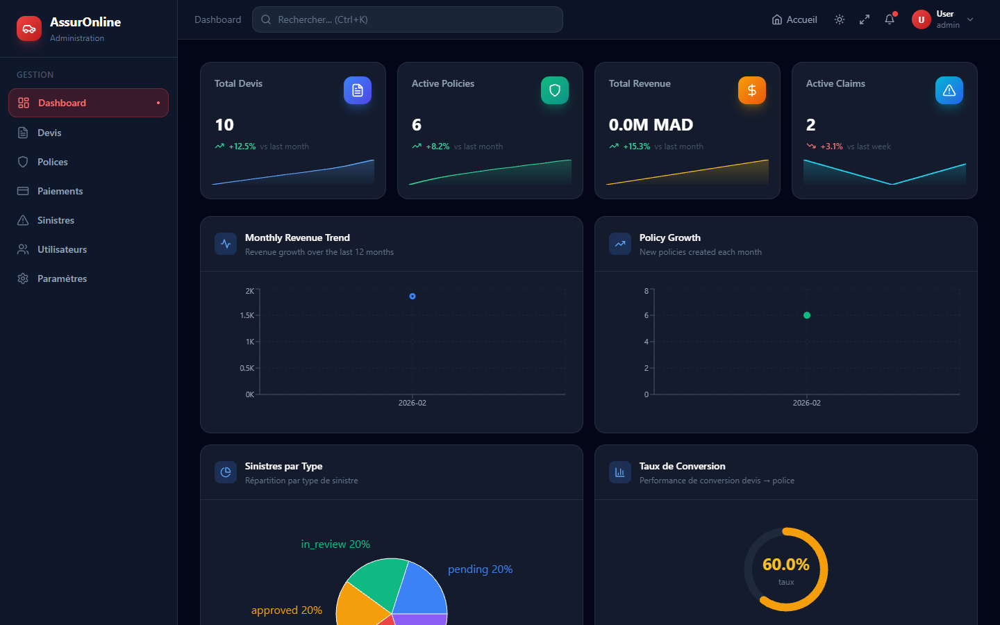
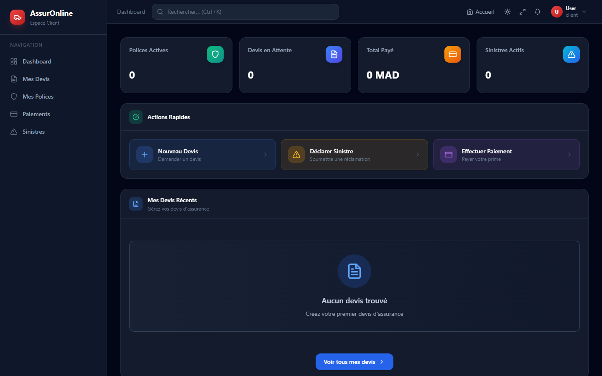
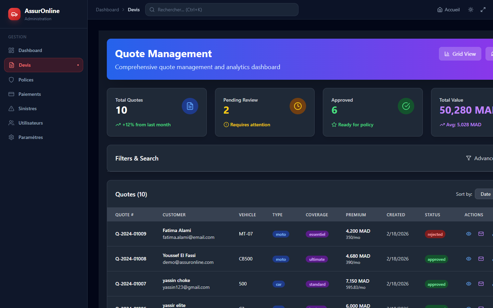
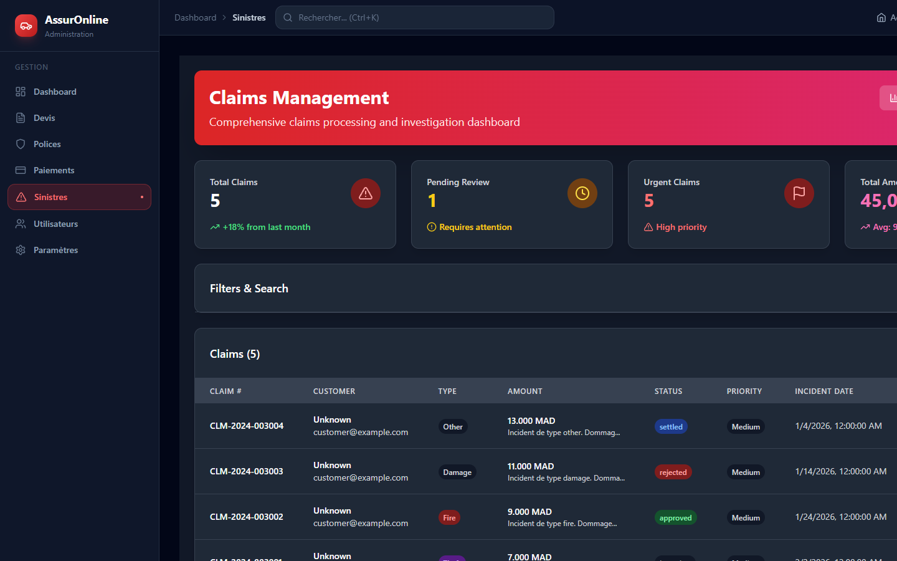

<div align="center">

# 🛡️ AssurOnline

**Plateforme de gestion d'assurances auto & moto — moderne, sécurisée et évolutive**

[](https://nodejs.org)
[](https://reactjs.org)
[](https://mysql.com)
[](LICENSE)

</div>

---

## 📸 Aperçu

### 🏠 Page d'Accueil


---

### 📊 Tableau de Bord Admin


---

### 👤 Espace Client


---

### 📋 Gestion des Devis


---

### 🚨 Gestion des Sinistres


---

---

## ✨ Fonctionnalités

| Module | Description |
|--------|-------------|
| 🔐 **Authentification** | JWT sécurisé, gestion des rôles (Client / Admin), RBAC |
| 📊 **Devis** | Création automatisée, calcul des primes, génération PDF, conversion → police |
| 📄 **Polices** | Suivi du cycle de vie, renouvellement, modification, historique |
| 🚨 **Sinistres** | Déclaration en ligne, upload de documents, workflow de traitement |
| 💳 **Paiements** | Enregistrement des transactions, génération de reçus |
| 📬 **Notifications** | Alertes en temps réel, rappels de paiement |
| 🛠️ **Admin Dashboard** | KPI, graphiques, taux de conversion, gestion des utilisateurs |

---

## 🛠️ Stack Technique

### Backend
- **Node.js 18** + **Express.js** — API REST
- **MySQL 8** + **Knex.js** — Base de données & migrations
- **JWT** — Authentification
- **Zod** — Validation des données
- **Nodemailer** — Envoi d'emails
- **PDFKit / Puppeteer** — Génération de PDF
- **Winston** — Logging
- **Helmet** + **express-rate-limit** — Sécurité

### Frontend
- **React 18** + **React Router v6**
- **Tailwind CSS** — Styling
- **Framer Motion** — Animations
- **Recharts** — Graphiques
- **Lucide React** — Icônes
- **Axios** — Requêtes HTTP

### DevOps
- **Docker** + **Docker Compose** — Conteneurisation
- **Jest** + **Supertest** — Tests
- **ESLint** + **Prettier** — Qualité du code

---

## 🚀 Démarrage Rapide

### Prérequis
- Node.js 18+
- MySQL 8+
- npm 9+

### Installation

```bash
# 1. Cloner le dépôt
git clone https://github.com/elite7770/assuronline.git
cd assuronline

# 2. Installer toutes les dépendances (racine + backend + frontend)
npm install

# 3. Configurer l'environnement backend
cp backend/.env.example backend/.env
# → Éditer backend/.env avec vos paramètres DB, JWT_SECRET, SMTP...

# 4. Créer la base de données et exécuter les migrations
npm run migrate:latest

# 5. Créer le compte administrateur par défaut
npm run seed:admin

# 6. Lancer en mode développement
npm run dev
```

L'application sera disponible sur :
- **Frontend** → http://localhost:5173
- **Backend API** → http://localhost:3001
- **API Docs (Swagger)** → http://localhost:3001/api/v1/docs

### Avec Docker

```bash
docker-compose up --build
```

---

## 🔑 Compte Admin par Défaut

| Champ | Valeur |
|-------|--------|
| Email | `admin@assuronline.com` |
| Mot de passe | `admin123` |

> ⚠️ Changez ce mot de passe immédiatement en production.

---

## 📁 Structure du Projet

```
assuronline/
├── backend/                    # API Node.js/Express
│   ├── src/
│   │   ├── features/           # Modules métier (auth, quotes, policies…)
│   │   ├── shared/             # Middlewares, utilitaires partagés
│   │   └── infrastructure/     # DB, services externes
│   ├── migrations/             # Migrations Knex
│   ├── scripts/                # Seed & utilitaires
│   └── tests/                  # Tests backend
├── frontend/                   # Application React
│   └── src/
│       ├── app/                # Pages, composants globaux, layout
│       ├── features/           # Modules UI (dashboard, auth, claims…)
│       └── shared/             # Composants, hooks, services réutilisables
├── docs/                       # Documentation & architecture
├── scripts/                    # Scripts utilitaires racine
└── docker-compose.yml
```

---

## 🔧 Scripts Disponibles

```bash
# ── Développement ──────────────────────────────────────────
npm run dev              # Démarre frontend + backend en parallèle
npm run dev:frontend     # Frontend uniquement (Vite)
npm run dev:backend      # Backend uniquement (nodemon)

# ── Base de données ────────────────────────────────────────
npm run migrate:latest   # Exécuter les migrations
npm run migrate:rollback # Annuler la dernière migration
npm run seed:admin       # Créer l'admin par défaut

# ── Tests ──────────────────────────────────────────────────
npm run test             # Tests unitaires (Jest)

# ── Qualité du code ────────────────────────────────────────
npm run lint             # ESLint
npm run format           # Prettier
```

---

## 🔐 Variables d'Environnement

Copiez `backend/.env.example` → `backend/.env` et renseignez :

```env
# Base de données
DB_HOST=localhost
DB_PORT=3306
DB_NAME=assuronline
DB_USER=root
DB_PASSWORD=your_password

# JWT
JWT_SECRET=your_super_secret_key_here

# Email (SMTP)
SMTP_HOST=smtp.gmail.com
SMTP_PORT=587
SMTP_USER=your_email@gmail.com
SMTP_PASS=your_app_password

# App
PORT=3001
CORS_ORIGINS=http://localhost:5173
```

---

## 🧪 Tests

```bash
cd backend
npm run test
```

---

## 📚 Documentation

- **API Swagger** : http://localhost:3001/api/v1/docs (en développement)
- **Architecture** : [`docs/architecture.md`](docs/architecture.md)
- **ERD** : [`docs/erd.md`](docs/erd.md)
- **ADRs** : [`docs/adrs/`](docs/adrs/)

---

## 🤝 Contribution

1. Fork le projet
2. Créer une branche feature (`git checkout -b feature/AmazingFeature`)
3. Commit les changements (`git commit -m 'Add some AmazingFeature'`)
4. Push vers la branche (`git push origin feature/AmazingFeature`)
5. Ouvrir une Pull Request

##  Équipe

- **Développeur Principal** : Ayman
- **Encadrant Académique** : 

## � Licence

Ce projet est sous licence [MIT](LICENSE). Voir le fichier `LICENSE` pour plus de détails.

---

<div align="center">

**AssurOnline** — Moderniser l'assurance avec la technologie 🚀

</div>
