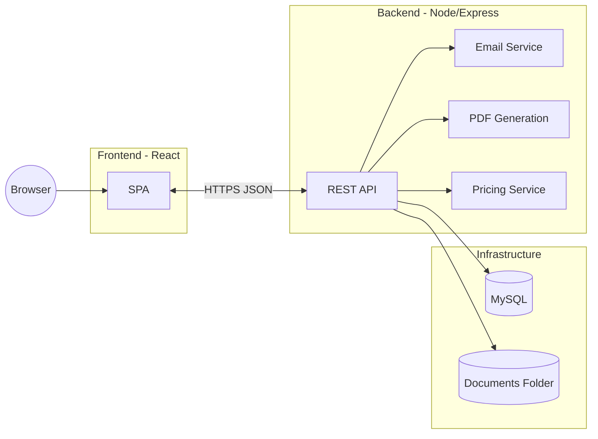
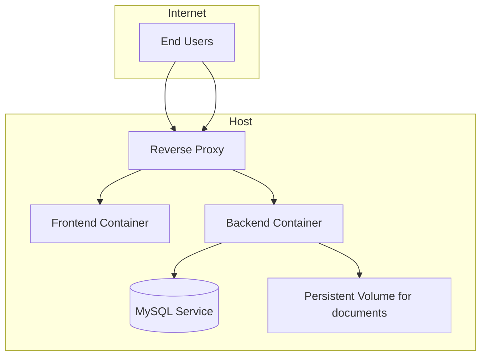

## System Architecture

The system is a classic three-tier web application.

### Deployment View

### Key Components

- Backend `Express` API with modules: auth, quotes, policies, payments, documents.
- MySQL via `mysql2` connection pool.
- PDF generation using `pdfkit`.
- Email delivery using `nodemailer`.

### Cross-cutting Concerns

- Authentication via JWT.
- Rate limiting and security headers.
- Input validation with `zod`.

