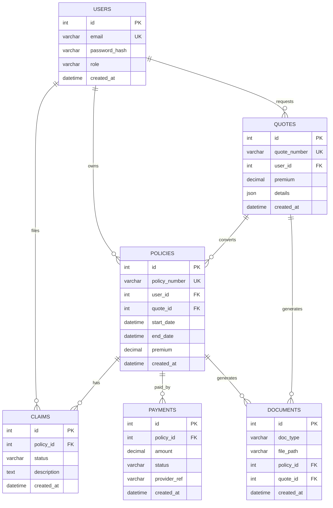

## Entity Relationship Diagram (ERD)

This ERD reflects the MySQL schema used by the backend.

```mermaid
erDiagram
  USERS ||--o{ POLICIES : owns
  USERS ||--o{ CLAIMS : files
  USERS {
    int id PK
    varchar email UK
    varchar password_hash
    varchar role
    datetime created_at
  }

  QUOTES {
    int id PK
    varchar quote_number UK
    int user_id FK
    decimal premium
    json details
    datetime created_at
  }
  USERS ||--o{ QUOTES : requests

  POLICIES {
    int id PK
    varchar policy_number UK
    int user_id FK
    int quote_id FK
    datetime start_date
    datetime end_date
    decimal premium
    datetime created_at
  }
  QUOTES ||--o{ POLICIES : converts

  CLAIMS {
    int id PK
    int policy_id FK
    varchar status
    text description
    datetime created_at
  }
  POLICIES ||--o{ CLAIMS : has

  PAYMENTS {
    int id PK
    int policy_id FK
    decimal amount
    varchar status
    varchar provider_ref
    datetime created_at
  }
  POLICIES ||--o{ PAYMENTS : paid_by

  DOCUMENTS {
    int id PK
    varchar doc_type
    varchar file_path
    int policy_id FK
    int quote_id FK
    datetime created_at
  }
  POLICIES ||--o{ DOCUMENTS : generates
  QUOTES ||--o{ DOCUMENTS : generates
```

Note: Field names may differ; align with `backend/database/*.sql`.

