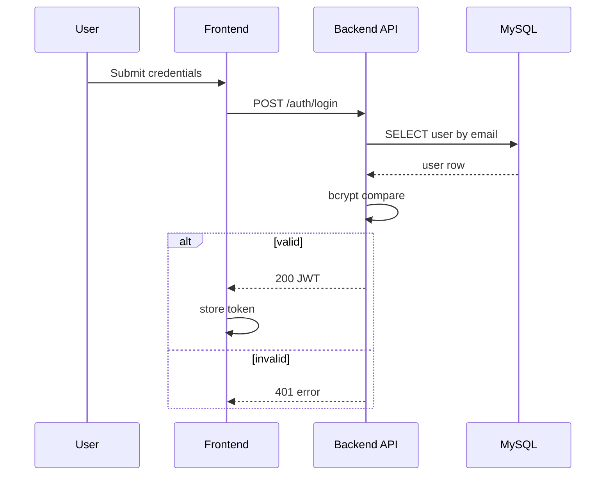

## Auth Sequence

```mermaid
sequenceDiagram
  participant U as User
  participant FE as Frontend
  participant BE as Backend API
  participant DB as MySQL

  U->>FE: Submit credentials
  FE->>BE: POST /auth/login
  BE->>DB: SELECT user by email
  DB-->>BE: user row
  BE->>BE: bcrypt compare
  alt valid
    BE-->>FE: 200 JWT
    FE->>FE: store token
  else invalid
    BE-->>FE: 401 error
  end
```

