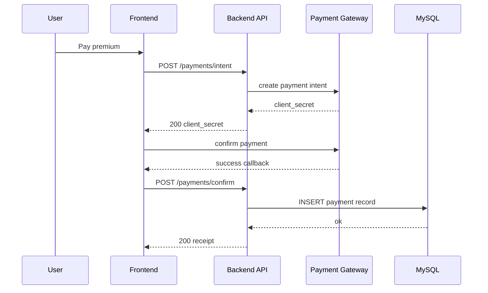

## Payments Sequence

```mermaid
sequenceDiagram
  participant U as User
  participant FE as Frontend
  participant BE as Backend API
  participant PG as Payment Gateway
  participant DB as MySQL

  U->>FE: Pay premium
  FE->>BE: POST /payments/intent
  BE->>PG: create payment intent
  PG-->>BE: client_secret
  BE-->>FE: 200 client_secret
  FE->>PG: confirm payment
  PG-->>FE: success callback
  FE->>BE: POST /payments/confirm
  BE->>DB: INSERT payment record
  DB-->>BE: ok
  BE-->>FE: 200 receipt
```

