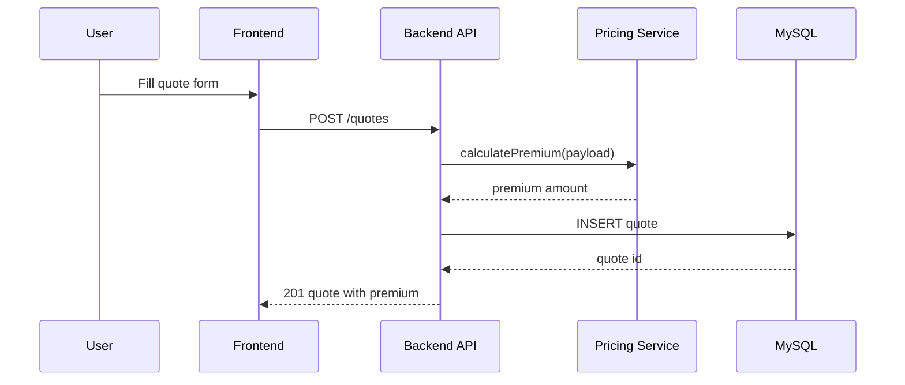

## Quote Generation Sequence

```mermaid
sequenceDiagram
  participant U as User
  participant FE as Frontend
  participant BE as Backend API
  participant PR as Pricing Service
  participant DB as MySQL

  U->>FE: Fill quote form
  FE->>BE: POST /quotes
  BE->>PR: calculatePremium(payload)
  PR-->>BE: premium amount
  BE->>DB: INSERT quote
  DB-->>BE: quote id
  BE-->>FE: 201 quote with premium
```

